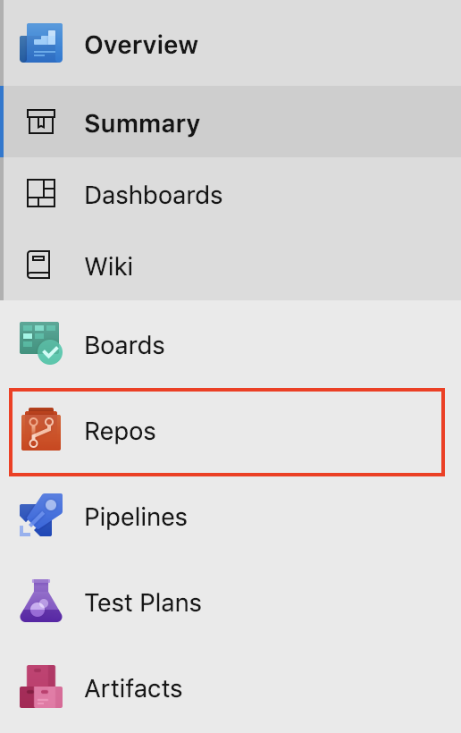
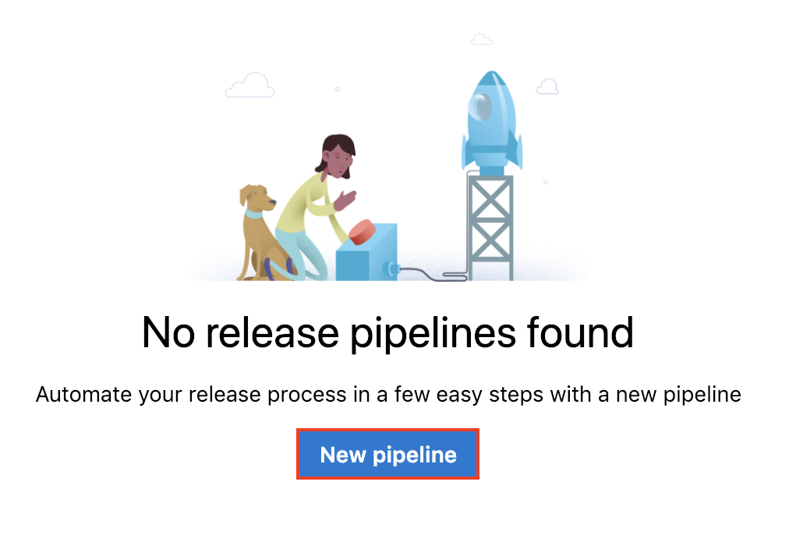
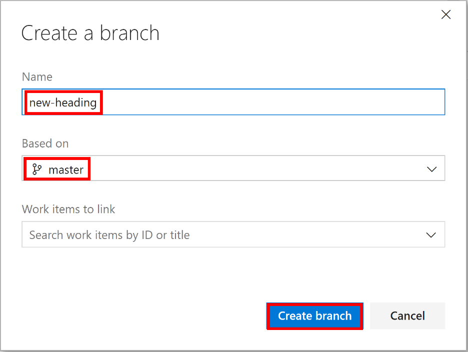
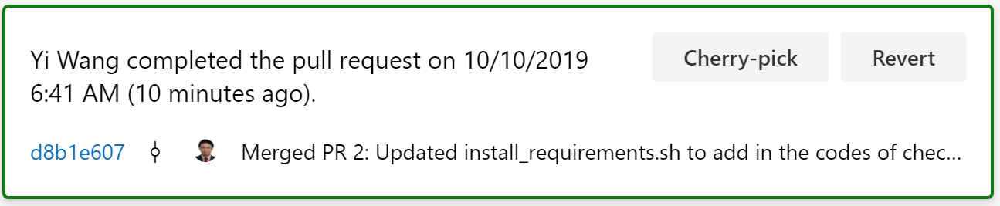

<div class="MCWHeader1">
Continuous delivery in Azure DevOps
</div>

<div class="MCWHeader2">
Hands-on lab step-by-step
</div>

<div class="MCWHeader3">
Oct 2019
</div>

Information in this document, including URL and other Internet Web site references, is subject to change without notice. Unless otherwise noted, the example companies, organizations, products, domain names, e-mail addresses, logos, people, places, and events depicted herein are fictitious, and no association with any real company, organization, product, domain name, e-mail address, logo, person, place or event is intended or should be inferred. Complying with all applicable copyright laws is the responsibility of the user. Without limiting the rights under copyright, no part of this document may be reproduced, stored in or introduced into a retrieval system, or transmitted in any form or by any means (electronic, mechanical, photocopying, recording, or otherwise), or for any purpose, without the express written permission of Microsoft Corporation.

Microsoft may have patents, patent applications, trademarks, copyrights, or other intellectual property rights covering subject matter in this document. Except as expressly provided in any written license agreement from Microsoft, the furnishing of this document does not give you any license to these patents, trademarks, copyrights, or other intellectual property.

The names of manufacturers, products, or URLs are provided for informational purposes only and Microsoft makes no representations and warranties, either expressed, implied, or statutory, regarding these manufacturers or the use of the products with any Microsoft technologies. The inclusion of a manufacturer or product does not imply endorsement of Microsoft of the manufacturer or product. Links may be provided to third party sites. Such sites are not under the control of Microsoft and Microsoft is not responsible for the contents of any linked site or any link contained in a linked site, or any changes or updates to such sites. Microsoft is not responsible for webcasting or any other form of transmission received from any linked site. Microsoft is providing these links to you only as a convenience, and the inclusion of any link does not imply endorsement of Microsoft of the site or the products contained therein.

© 2019 Microsoft Corporation. All rights reserved.

Microsoft and the trademarks listed at https://www.microsoft.com/en-us/legal/intellectualproperty/Trademarks/Usage/General.aspx are trademarks of the Microsoft group of companies. All other trademarks are property of their respective owners.

**Contents**
<!-- TOC -->

- [Continuous delivery in Azure DevOps hands-on lab step-by-step](#continuous-delivery-in-azure-devops-hands-on-lab-step-by-step)
  - [Abstract and learning objectives](#abstract-and-learning-objectives)
  - [Solution architecture](#solution-architecture)
  - [Requirements](#requirements)
  - [Exercise 1: Create Azure DevOps project and Git Repository](#exercise-1-create-azure-devops-project-and-git-repository)
    - [Task 1: Create Azure DevOps Account](#task-1-create-azure-devops-account)
    - [Task 2: Add the Tailspin Toys source code repository to Azure DevOps](#task-2-add-the-tailspin-toys-source-code-repository-to-azure-devops)
  - [Exercise 2: Create Azure DevOps build pipeline](#exercise-2-create-azure-devops-build-pipeline)
    - [Task 1: Create a build pipeline](#task-1-create-a-build-pipeline)
  - [Exercise 3: Create Azure DevOps release pipeline](#exercise-3-create-azure-devops-release-pipeline)
    - [Task 1: Create a release definition](#task-1-create-a-release-definition)
    - [Task 2: Add test and production environments to release pipeline](#task-2-add-test-and-production-environments-to-release-pipeline)
  - [Exercise 4: Trigger a build and release](#exercise-4-trigger-a-build-and-release)
    - [Task 1: Manually queue a new build and follow it through the release pipeline](#task-1-manually-queue-a-new-build-and-follow-it-through-the-release-pipeline)
  - [Exercise 5: Create a feature branch and submit a pull request](#exercise-5-create-a-feature-branch-and-submit-a-pull-request)
    - [Task 1: Create a new branch](#task-1-create-a-new-branch)
    - [Task 2: Make a code change to the feature branch](#task-2-make-a-code-change-to-the-feature-branch)
    - [Task 3: Submit a pull request](#task-3-submit-a-pull-request)
    - [Task 4: Approve and complete a pull request](#task-4-approve-and-complete-a-pull-request)
  - [After the hands-on lab](#after-the-hands-on-lab)
    - [Task 1: Delete resources](#task-1-delete-resources)

<!-- /TOC -->

# Continuous delivery in Azure DevOps hands-on lab step-by-step

## Abstract and learning objectives 

 This lab will help you to understand how to build the Continuous Integration and Continuous Delivery pipeline for a ML/AI project. We will be using the Azure DevOps Project for build and release/deployment pipelines along with Azure ML services for model retraining pipeline, model management and operationalization.
 


This template contains code and pipeline definition for a machine learning project demonstrating how to automate an end to end ML/AI workflow. The build pipelines include DevOps tasks for data sanity test, unit test, model training on different compute targets, model version management, model evaluation/model selection, model deployment as realtime web service, staged deployment to QA/prod and integration testing.

## Solution architecture

This reference architecture shows how to implement continuous integration (CI), continuous delivery (CD), and retraining pipeline for an AI application using Azure DevOps and Azure Machine Learning. The solution is built on the scikit-learn diabetes dataset but can be easily adapted for any AI scenario and other popular build systems such as Jenkins and Travis.


## Requirements

1.  Microsoft Azure subscription

  >**Note**: This entire lab can be completed using only the Azure Portal.

## Exercise 1: Create Azure DevOps project and Git Repository

Duration: 15 Minutes

In this exercise, you will create and configure an Azure DevOps account along with an Agile project.

### Task 1: Create Azure DevOps Account

1.  Browse to the Azure DevOps site at <https://dev.azure.com>.

2.  If you do not already have an account, select the **Start free** button.
    
    

3.  Authenticate with a Microsoft account.

4.  Choose **Continue** to accept the Terms of Service, Privacy Statement, and Code of Conduct.

5.  Choose a name for new your project. For the purposes of this scenario, we will use "myML-DevOps". Choose **Private** in the Visibility section so that our project is only visible to those who we specifically grant access. Then, select **+ Create project**.
    
    

6.  Once the Project is created, click on the **Repos** menu option in the left-hand navigation.

    

7.  On the **Repos** page for the **myML-DevOps** repository, locate the "or push an existing repository from command line" section. Click the Copy button to copy the contents of the panel. We're going to use these commands in an upcoming step.

    

### Task 2: Add the myML-DevOps source code repository to Azure DevOps

In this Task, you will configure the Azure DevOps Git repository. You will configure the remote repository using Git and then push the source code up to Azure DevOps through the command line tools.

1.  Open the **Azure Cloud Shell** to the folder where the Student Files were unzipped (i.e. studentfiles). Then, navigate to the **DevOps-for-AI** folder under **studentfiles** folder which contains the source code for ml application.

    > **Note**: If this folder doesn't exist ensure you followed the instructions in the Before the HOL.

2. Open Code to this folder by typing: 
   
   ```
   code .
   ``` 

   Then press **Enter**. 
   
   >**Note**: Be sure to include the period after the code command as this is what opens Code to the current folder.
   
3.  In a command prompt window, initialize a local Git repository by running the following command:

    > If a ".git" folder and local repository already exists in the folder, then you will need to delete the ".git" folder first before running the commands below to initialize the Git repository.

    ```
    git init
    ```

4.  Paste the first command you copied from Azure DevOps. It will resemble the command below:
    
    ```
    git remote add origin https://<your-org>@dev.azure.com/<your-org>/myML-DevOps/_git/myML-DevOps
    ```

5.  Enter the following commands to commit the changes made locally to the new repository:
    
    ```
    git add *
    git commit -m "adding files"
    ```

6.  Push the changes up to the Azure DevOps repository with the following command:

    ```
    git push -u origin --all
    ```
    If the password is requried, you may navigate to your profile (at top right corner) and select **Security**. Then go to **Personal access tokens** and create a new token. 

    
    
     

7.  Leave that command prompt window open and switch back to the web browser window for Azure DevOps from the previous Task. Navigate to the Repos > Files page which shows the files in the repository. You may need to refresh the page to see the updated files. Your source code is now appearing in Azure DevOps.

## Exercise 2: Create Azure DevOps build pipeline

Duration: 15 Minutes

Implementing CI and CD pipelines helps to ensure consistent and quality code that's readily available to users. Azure Pipelines is a quick, easy, and safe way to automate building your projects and making them available to users,

In this exercise, you will create a build definition using, Azure Pipelines, that will automatically build the web application with every commit of source code. This will lay the groundwork for us to then create a release pipeline for publishing the code to our Azure environments.
  
### Task 1: Create a build pipeline

Pipelines are made of one or more stages describing a CI/CD process. Stages are the major divisions in a pipeline: "build this app", "run these tests", and "deploy to pre-production" are good examples of stages.

Stages consist of one or more jobs, which are units of work assignable to a particular machine. Both stages and jobs may be arranged into dependency graphs: "run this stages before that one" or "this job depends on the output of that job".

Jobs consist of a linear series of steps. Steps can be tasks, scripts, or references to external templates.

This hierarchy is reflected in the structure of a YAML file.

1.  In your Azure DevOps project, select the Pipelines menu option from the left-hand navigation.

    

2.  Select the **New pipeline** button to create a new build pipeline.

    

3.  This starts a wizard where you'll first need to select where your current code is located. In a previous step, you pushed code up to Azure Repos. Select the **Azure Repos Git** option.

    

4.  Next, you'll need to select the specific repository where your code was pushed. In a previous step, you pushed it to the **myML-DevOps** repository. Select the **myML-DevOps** git repository.

    

5.  Then, you'll need to select the type of pipeline to configure. Although this pipeline contains a mix of technologies, select **Starter pipeline** from the list of options.

    

6.  As a final step in the creation of a build pipeline, you are presented with a configured pipeline in the form of an azure-pipelines.yml file. 
   
7.  This starter YAML file contains a few lines of instructions (shown below) for the pipeline. Let's begin by updating the YAML with more specific instructions to build our application. 

    

The "pool" section specifies which pool to use for a job of the pipeline. It also holds information about the job's strategy for running.

8.  Add new task in the steps list to setup Python environment by either edit the yml file or use the task assistant. 

    Show task assistant by click the button at top right corner **Show assistant**
    

    To add task of Use Python 3.6 in the yml file
    

    ```yml
    steps:
    - task: UsePythonVersion@0
      displayName: 'Use Python 3.6'
      inputs:
        versionSpec: 3.6
    ```

    Tasks are the building blocks of a pipeline. They describe the actions that are performed in sequence during an execution of the pipeline.

9.  Add the task to install other Python packages needed using the following code:
    
    ```yml
     - task: ShellScript@2
       displayName: 'Install Requirements'
       inputs:
         scriptPath: 'environment_setup/install_requirements.sh'
         disableAutoCwd: true
         cwd: 'environment_setup'
    ```

10. Add the task to create Azure ML workspace using the below yml code or task assistant

    To add task of Create Azure ML Workspace uisng Azure CLI
    

    

    ```yml
        - task: AzureCLI@2
          inputs:
            azureSubscription: '<Your Azure Subscription>'
            scriptType: 'bash'
            scriptLocation: 'inlineScript'
            inlineScript: 'python aml_service/00-WorkSpace.py'
        ```
11. Select and replace the rest "task" section with the following code:
    
    >**Note**: The YAML below creates individual tasks for performing all the necessary steps to build and test our application along with publishing the artifacts inside Azure DevOps so they can be retrieved during the upcoming release pipeline process.

    ```yaml
    
        - task: AzureCLI@2
          displayName: 'Start Training on Local'
          inputs:
            azureSubscription: '<Your Azure Subscription>'
            scriptType: 'bash'
            scriptLocation: 'inlineScript'
            inlineScript: 'python aml_service/10-TrainOnLocal.py'

        - task: AzureCLI@2
          displayName: 'Evaluate Production Model with Newly trained model'
          inputs:
            azureSubscription: '<Your Azure Subscription>'
            scriptType: 'bash'
            scriptLocation: 'inlineScript'
            inlineScript: 'python aml_service/15-EvaluateModel.py'
            
        - task: AzureCLI@2
          displayName: 'Register Model'
          inputs:
            azureSubscription: '<Your Azure Subscription>'
            scriptType: 'bash'
            scriptLocation: 'inlineScript'
            inlineScript: 'python aml_service/20-RegisterModel.py'

        - task: AzureCLI@2
          displayName: 'Create Scoring Docker Image'
          inputs:
            azureSubscription: '<Your Azure Subscription>'
            scriptType: 'bash'
            scriptLocation: 'inlineScript'
            inlineScript: 'python aml_service/30-CreateScoringImage.py'

        - task: CopyFiles@2
          displayName: 'Copy Files to: $(Build.ArtifactStagingDirectory)'
          inputs:
            SourceFolder: '$(Build.SourcesDirectory)'
            TargetFolder: '$(Build.ArtifactStagingDirectory)'

        - task: PublishBuildArtifacts@1
          displayName: 'Publish Artifact: Repo'
          inputs:
            ArtifactName: 'devops-for-ai'
    ```

12. The final result will look like the following:

    ```yml
    trigger:
    - master

    pool:
    vmImage: 'ubuntu-latest'

    steps:
    - script: echo Hello, world!
      displayName: 'Run a one-line script'

    - script: |
        echo Add other tasks to build, test, and deploy your project.
        echo See https://aka.ms/yaml
      displayName: 'Run a multi-line script'

    - task: UsePythonVersion@0
      inputs:
        versionSpec: '3.6'
        addToPath: true
        architecture: 'x64'

    - task: ShellScript@2
      displayName: 'Install Requirements'
      inputs:
        scriptPath: 'environment_setup/install_requirements.sh'
        disableAutoCwd: true
        cwd: 'environment_setup'    

    - task: AzureCLI@2
      inputs:
        azureSubscription: '<Your Azure Subscription>'
        scriptType: 'bash'
        scriptLocation: 'inlineScript'
        inlineScript: 'python aml_service/00-WorkSpace.py'

    - task: AzureCLI@2
      inputs:
        azureSubscription: '<Your Azure Subscription>'
        scriptType: 'bash'
        scriptLocation: 'inlineScript'
        inlineScript: 'python aml_service/10-TrainOnLocal.py'

    - task: AzureCLI@2
      inputs:
        azureSubscription: '<Your Azure Subscription>'
        scriptType: 'bash'
        scriptLocation: 'inlineScript'
        inlineScript: 'python aml_service/15-EvaluateModel.py'

    - task: AzureCLI@2
      inputs:
        azureSubscription: '<Your Azure Subscription>'
        scriptType: 'bash'
        scriptLocation: 'inlineScript'
        inlineScript: 'python aml_service/20-RegisterModel.py'

    - task: AzureCLI@2
      inputs:
        azureSubscription: '<Your Azure Subscription>'
        scriptType: 'bash'
        scriptLocation: 'inlineScript'
        inlineScript: 'python aml_service/30-CreateScoringImage.py'

    - task: CopyFiles@2
      inputs:
        SourceFolder: '$(Build.SourcesDirectory)'
        Contents: '**'
        TargetFolder: '$(Build.ArtifactStagingDirectory)'

    - task: PublishBuildArtifacts@1
      inputs:
        PathtoPublish: '$(Build.ArtifactStagingDirectory)'
        ArtifactName: 'devops-for-ai'
        publishLocation: 'Container'
    ```

13. Choose the **Save** button to save our new pipeline and also kick off the first build.

        

14. The new azure-pipelines.yml file will automatically be added to the root of your TailspinToys repository. This is done through a git commit that Azure DevOps facilitates. You are then asked to enter a commit description. By default, it will be populated for you. Once again, select the **Save** button at the bottom of the screen.

       

15. The build process will immediately begin and run through the steps defined in the azure-pipelines.yml file. Your Azure DevOps screen will refresh to show you the build process executing, in real-time. 

       

15.  After the build process completes, you should see a green check mark next to each of the build pipeline steps.
  
   
    
  Congratulations! You have just created your first build pipeline. In the next exercise, we will create a release pipeline that deploys your successful builds.

## Exercise 3: Create Azure DevOps release pipeline

Duration: 30 Minutes

In this exercise, you will create a release pipeline in Azure DevOps that performs automated deployment of build artifacts to Microsoft Azure. The release pipeline will deploy to three stages: dev, test, and production.

### Task 1: Create a release definition

1.  Select **Releases** on the left-hand navigation. This will bring up the Releases screen. 

    

2.  Choose the **New pipeline** button to begin the creation of a new release pipeline.

    

3.  Then, you'll need to select the template that matches the pipeline you are building. Since we are deploying an machine learning services, select **Machine Learning Model** from the list of templates and choose the **Apply** button.

    

4.  This will present you with the New release pipeline editor which allows you to manage your release stages. A stage is a logical and independent concept that represents where you want to deploy a release generated from a release pipeline. Often times, this is considered an environment. Let's start by giving this stage a name. Change the value "Stage 1" in the editor to "QA - Deploy on ACI" and then select the "X" in the top-right corner to close the panel and save the name change.

    

5.  A release consists of a collection of artifacts in your CD/CD process. An artifact is any deployable component of your application. When authoring a release pipeline, you link the appropriate artifact sources to your release pipeline. In this step, we will connect the artifacts from our previously created build pipeline to this newly created release pipeline. Select the "+ Add" button next to "Artifacts" or the "+ Add an artifact" icon inside the "Artifacts" box. Both buttons perform the same action.

    

6.  The Add an artifact panel will display several configurations for linking to an artifact. In the **Source (build pipeline)** dropdown list, select **myML-DevOps**. In the **Default version** field, select **Latest**. The panel fields will adjust to show additional details based on your selection. The default values will produce a new release when future builds successfully complete. Select the **Add** button.

    

7.  Now, it is time to begin configuring specific tasks to perform our deployment during the dev stage. To navigate to the task editor, select the **Task** menu item.

    

8.  This brings up the task editor and opens a panel with configuration details for the dev stage we created earlier. The configuration items set here will be made available to the tasks in this stage.

9.  On this panel, we first need to configure the necessary details to connect the task to Azure for deployment. Let's first start by connecting to our Azure subscription. Select your Azure subscription from the "Azure subscription" dropdown and then choose the **Authorize** button to login and authenticate to the selected subscription.

    

10. Then, setup the setting for "Run on agent".

    

11. Delete the default 2 Azure CLI tasks. Select the 2 tasks and click the delete button.
     

12. Now, let's add the task needed to do the QA release. The first step is to setup the Python version. Search "Use" on the task assitant seach bar and select "Use Python Version", then click "Add" button to insert the task

    
    
    Set the "Display name" as "Use Python 3.6" and "Version spec" as "3.6"
    
13. Then we will add in the task to setup other Python packages. Click the add button and select "Bash Script".
    
    

    Click "Bash Scrip" to setup it. Add in "$(System.DefaultWorkingDirectory)/_myML-DevOps/devops-for-ai/environment_setup/install_requirements.sh" into "Script Path" and add "$(System.DefaultWorkingDirectory)/_myML-DevOps/devops-for-ai/environment_setup" into "Working Directory" leave the rest as default.

    
    
14. Continue to add another new Azure CLI task to deploy the ML model as a webservice into Azure ACI. Click add button and seach "Azure CLI" and select "Azure CLI"

     

    Follow the below screen to setup the Azure CLI. Set the Display Name as "50. Deploy Webservice on ACI", Script Location as "Inline Script", Inline Script as "python ./aml_service/50-deployOnAci.py" and Working Directory as "$(System.DefaultWorkingDirectory)/_myML-DevOps/devops-for-ai"

     
     

15. Add the last Azure CLI task to test the ACI webservice. Click the add button and seach "Azure CLI" and select "Azure CLI"

     

    Follow the below screen to setup the Azure CLI. Set the Display Name as "60. Test ACI Webservice", Script Location as "Inline Script", Inline Script as "python ./aml_service/60-AciWebserviceTest.py" and Working Directory as "$(System.DefaultWorkingDirectory)/_myML-DevOps/devops-for-ai".

     
    

16. Give the pipeline the name "Deploy Webservie", Select "Save" button at the top of the screen and confirm by clicking the "OK" button.

     

17. Congratulations! You have just created your first release pipeline.

### Task 2: Add production environments to release pipeline

1.  On the Pipeline tab, move your mouse over the "QA-Deploy on ACI" stage and a select the **Clone** button to create a copy of the tasks from this stage. We will use the same steps to deploy to test with a few configuration changes.

    

2.  Select the newly created stage titled "QA-Deploy on ACI" to bring up the stage configuration panel.

3.  Change the "Stage name" to **Prod - Deploy On AKS** and then close the panel.

    

4.  Now, we will begin modifying the configuration specifics for the "QA-Deploy on ACI" stage. Select the "1 job, 4 tasks" link for the test stage.

    

5.  This opens the configuration panel for the stage. Locate the 3rd task : "50. Deploy Webservice on ACI" and change the config to make it deploy on AKS.

    

6.  Select the "60. Test ACI Webservice" task to bring up the task configuration panel. Change the Display Name as "61. Test AKS Webservice" and Inline Script as "python ./aml_service/61-AksWebserviceTest.py".

     

7. Go back release pipeline config panel and set the pre-deployment conditions for the stage of "Prod - Deploy On AKS". Will assign the approvals.
    
    
    
    On the Pre-deployment conditions panel, collapse Triggers section. Locate "Pre-deployment approvals" and enable it, assign an approval. 

     

8.  Select the "Save" button at the top of the screen, and confirm by choosing the "OK" button.

9. Congratulations! You have just created a produciton stage and added it to your pipeline.

10. The final release pipeline should look like the screen shot below:

    

11. Now you will enable the continuous deployment trigger, so the release process automatically begins as soon as a build successfully completes. To do this, select the lightning bolt icon in the Artifacts window.

12. This will bring up the Continuous deployment trigger panel. Change the setting to "Enabled".

    

15. Select Save, and confirm your changes by clicking "OK". Then, close the panel.

Congratulations! You have completed the creation of a release pipeline with three stages.

## Exercise 4: Trigger a build and release

Duration: 10 Minutes

In this exercise, you will trigger an automated build and release of the ML model using the build and release pipelines you created in earlier exercises. The release pipeline will deploy to 2 stages: QA, and production.

Any commit of new or modified code to the master branch will automatically trigger a build. The steps below are useful when you want to manually trigger a build without a code change.

### Task 1: Manually queue a new build and follow it through the release pipeline

1.  Select the "Pipelines" menu item from the left-hand navigation. Then, choose the "Queue" button.

    

2.  This will present a popup titled "Run pipeline". Select the "Run" button at the bottom of the popup.

    

3. The screen will refresh and begin to show details about the build process.

4.  If the build is successful, it will resemble the screen shot below.

    

5.  Because we configured continuous deployment, the deployment to the "QA - Deploy on ACI" stage will then be triggered immediately. It will continue through on to the production stage after approval. A successful release through all three stages will look like the screen shot below.

    

## Exercise 5: Create a feature branch and submit a pull request

Duration: 20 Minutes

In this exercise, you will create a short-lived feature branch, make a small code change, commit the code, and submit a pull request. You'll then merge the pull request into the master branch which triggers an automated build and release of the application.

In the tasks below, you will make changes directly through the Azure DevOps web interface. These steps could also be performed through an IDE of your choosing or using the Azure Cloud Shell Code Editor.

### Task 1: Create a new branch

1.  Select the "Repos" menu item from the left-hand navigation. Then, choose "Branches".

    

2.  Select the "New branch" button in the upper right corner of the page.

    

3.  In the "Create a branch" dialog, enter a name for the new branch. In this scenario, name it "new-heading". In the "Based on" field, be sure **master** is selected.

    

4.  Select "Create branch".

### Task 2: Make a code change to the feature branch

1.  Choose the name of the newly created branch. This will present the "Files" window showing all the files in the repository.

    

2.  Next, you'll make a change to a page in the web application inside the web browser.

3.  Select the "environment_setup" folder.

4.  Locate and select the "install_requirements.sh" file. It will display the contents of the file.

5.  Select the "Edit" button on the top right of the screen to begin editing the page.

    

6.  Add in code to check OS version. Add in the below codes

    ```
    #Check OS
    cat /etc/os-release

    ```
    
10.  Now that you've completed the code change, select the "Commit..." button on the top right side of the screen.

  

11. This will present the Commit popup where you can enter a comment. Select the "Commit" button.

     

### Task 3: Submit a pull request

1.  Near the top of the screen, locate the "Create a pull request" link.

    

2.  This brings up the "New Pull Request" page. It shows we are submitting a request to merge code from our **new-heading** branch into the **master** branch. You have the option to change the "Title" and "Description" fields. Locate the "Reviewers" field. 

    

3.  Select the "Create" button to submit the pull request.

### Task 4: Approve and complete a pull request

Typically, the next few steps would be performed by another team member. This would allow for the code to be peer reviewed. However, in this scenario, you will continue as if you are the only developer on the project.

1.  After submitting the pull request, you are presented with Pull Request review screen. Let's assume all the changes made were acceptable to the review team.

2.  First, select the "Approve" button to approve of the code that was modified submitted as part of the pull request.

3.  This will note that you approved the pull request. Then, choose the "Complete" button to finish and merge the code from the pull request into the master branch.

    

4.  After choosing the Complete button in the previous step, you will be presented with the Complete pull request popup. You can add additional comments for the merge activity. By selecting the "Delete new-heading after merging" option, our branch will be deleted after the merge has been completed. This keeps our repository clean of old and abandoned branches and eliminates the possibility of future confusion.

    

5.  Select the "Complete merge" button.

6.  You will then see a confirmation of the completed pull request.

    

7.  Congratulations! You just created a branch, made a code change, submitted a pull request, approved the pull request, and merged the code.

8.  Because we configured continuous integration and continuous deployment, an automated build will be triggered and deployment to dev stage will then begin immediately after a successful build. It will continue through on to the test and production stages.

    

## After the hands-on lab

Duration: 10 Minutes

### Task 1: Delete resources

1.  Now since the hands-on lab is complete, go ahead and delete the resource group you created along with the Azure DevOps project that were created for this hands-on lab. You will no longer need those resources and it will be beneficial to clean up your Azure Subscription.

These steps should be followed only *after* completing the hands-on lab.
